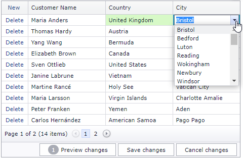

<!-- default badges list -->

[](https://supportcenter.devexpress.com/ticket/details/T155879)
[](https://docs.devexpress.com/GeneralInformation/403183)
<!-- default badges end -->
# Grid View for ASP.NET MVC - Implement cascading combo boxes in batch edit mode
<!-- run online -->
**[[Run Online]](https://codecentral.devexpress.com/t155879/)**
<!-- run online end -->

This example demonstrates how to create combo box editors and configure the grid's cell edit functionality in batch mode.



## Overview

Follow the steps below to implement cascading combo boxes in batch edit mode:

1. Create a combo box column - call the [MVCxGridViewColumn.EditorProperties](https://docs.devexpress.com/AspNetMvc/DevExpress.Web.Mvc.MVCxGridViewColumn.EditorProperties) method and add a [MVCxColumnComboBoxProperties](https://docs.devexpress.com/AspNetMvc/DevExpress.Web.Mvc.MVCxColumnComboBoxProperties) object.

    ```cshtml
    settings.Columns.Add(c => c.CountryId, country => {
        country.Caption = "Country";
        country.EditorProperties().ComboBox(cs => cs.Assign(ComboBoxPropertiesProvider.Current.CountryComboBoxProperties));
    });
    settings.Columns.Add(c => c.CityId, city => {
        city.Caption = "City";
        city.EditorProperties().ComboBox(cs => cs.Assign(ComboBoxPropertiesProvider.Current.CityComboBoxProperties));
    });
    ```

2. Handle the grid's client-side [BatchEditStartEditing](https://docs.devexpress.com/AspNet/js-ASPxClientGridView.BatchEditStartEditing) event. In the handler, get the cell value and call the secondary combo box editor's `PerformCallback` method to update the editor's data.

    ```js
    function OnBatchEditStartEditing(s, e) {
        curentEditingIndex = e.visibleIndex;
        var currentCountry = grid.batchEditApi.GetCellValue(curentEditingIndex, "CountryId");
        if (currentCountry != lastCountry && e.focusedColumn.fieldName == "CityId" && currentCountry != null) {
            lastCountry = currentCountry;
            grid.GetEditor("CityId").PerformCallback();        
        }
    }
    ```

3. Handle the primary editor's client-side [SelectedIndexChanged](https://docs.devexpress.com/AspNet/js-ASPxClientComboBox.SelectedIndexChanged) event. In the handler, get the editor's value and send a callback to the server.

    ```js
    function CountriesCombo_SelectedIndexChanged(s, e) {
        lastCountry = s.GetValue();
        isCustomCascadingCallback = true;
        grid.GetEditor("CityId").PerformCallback();
    }
    ```

4. Use the [GetComboBoxCallbackResult](https://docs.devexpress.com/AspNetMvc/DevExpress.Web.Mvc.GridExtensionBase.GetComboBoxCallbackResult.overloads) method to get the result of callback processing.

    ```csharp
    public ActionResult ComboBoxCountryPartial(){
        return GridViewExtension.GetComboBoxCallbackResult(ComboBoxPropertiesProvider.Current.CountryComboBoxProperties);
    }
    public ActionResult ComboBoxCityPartial(){
        return GridViewExtension.GetComboBoxCallbackResult(ComboBoxPropertiesProvider.Current.CityComboBoxProperties);
    }
    ```

4. Handle the secondary editor's [EndCallback](https://docs.devexpress.com/AspNet/js-ASPxClientComboBox.EndCallback) event to select an item after the callback.

    ```js
    function CitiesCombo_EndCallback(s, e) {
        if (isCustomCascadingCallback) {
            if (s.GetItemCount() > 0)
                grid.batchEditApi.SetCellValue(curentEditingIndex, "CityId", s.GetItem(0).value);
            isCustomCascadingCallback = false;
        }
    }
    ```


## Files to Review

* [HomeController.cs](./CS/Controllers/HomeController.cs) (VB: [HomeController.vb](./VB/Controllers/HomeController.vb))
* [ComboBoxPropertiesProvider.cs](./CS/Models/ComboBoxPropertiesProvider.cs) (VB: [ComboBoxPropertiesProvider.vb](./VB/Models/ComboBoxPropertiesProvider.vb))
* [Customer.cs](./CS/Models/Customer.cs) (VB: [Customer.vb](./VB/Models/Customer.vb))
* [CascadingComboBoxesBatchEdit.js](./CS/Scripts/CascadingComboBoxesBatchEdit.js) (VB: [CascadingComboBoxesBatchEdit.js](./VB/Scripts/CascadingComboBoxesBatchEdit.js))
* [GridViewPartial.cshtml](./CS/Views/Home/GridViewPartial.cshtml)
* [Index.cshtml](./CS/Views/Home/Index.cshtml)

## Documentation

* [Batch Edit Mode in Grid](https://docs.devexpress.com/AspNetMvc/16147/components/grid-view/data-editing-and-validation/batch-edit)
* [ComboBox](https://docs.devexpress.com/AspNetMvc/8984/components/data-editors-extensions/combobox)

## More Examples

* [Grid View for ASP.NET Web Forms - Cascading Combo Boxes in Batch Edit Mode](https://github.com/DevExpress-Examples/asp-net-web-forms-grid-cascading-comboboxes-in-batch-edit-mode)
